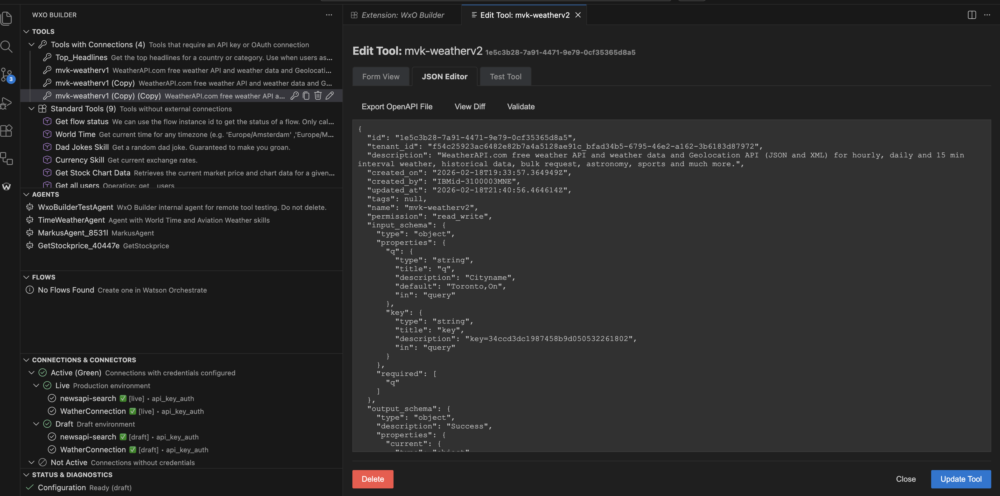
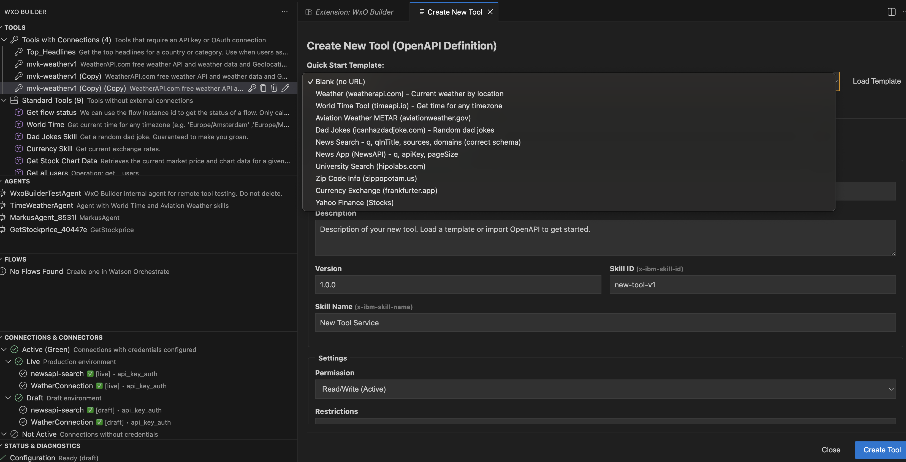
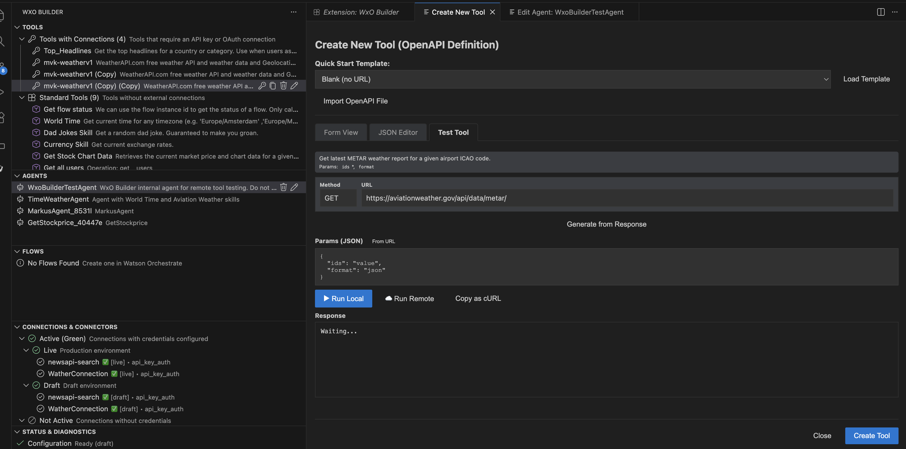
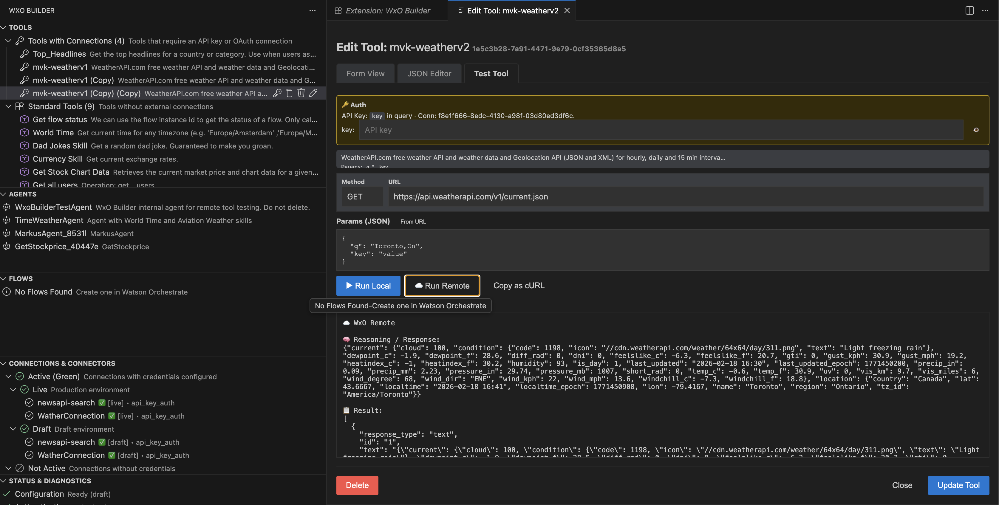
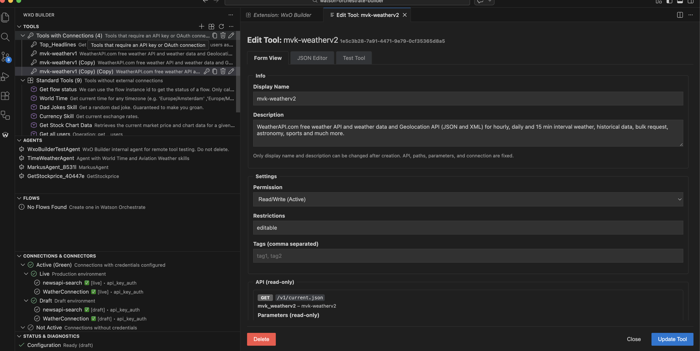
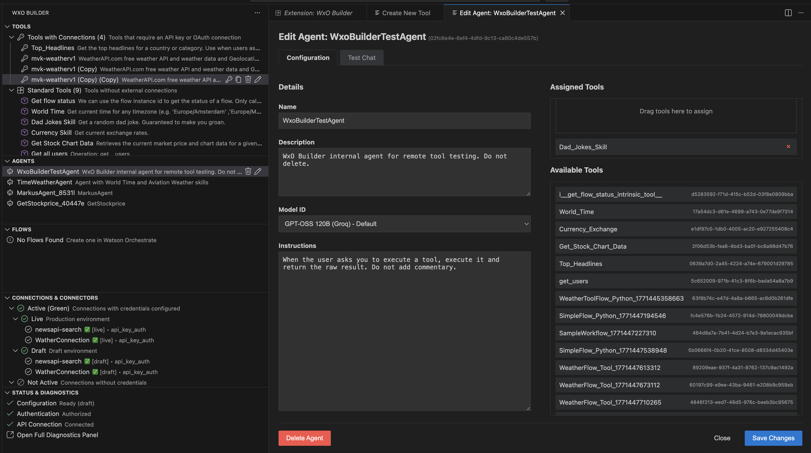
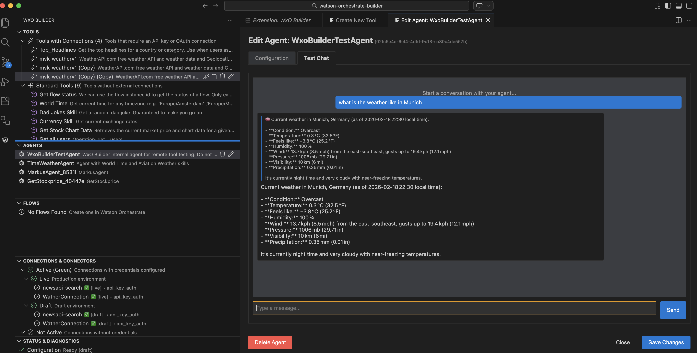
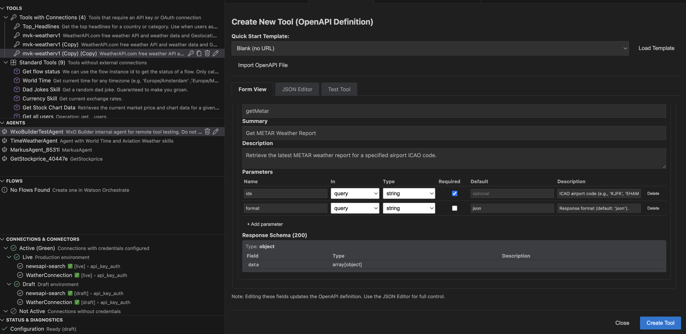

# WxO Builder (Watsonx Orchestrate Development Tool) - BETA

> **Note:** This extension is currently in **Beta**. Features are subject to change, and you may encounter issues. Please report any bugs or feedback to the [repository issues page](https://github.com/markusvankempen/wxo-builder-vscode-extension/issues).

**WxO Builder** is the essential toolkit for developers building on **IBM Watsonx Orchestrate**. It integrates directly into Visual Studio Code, allowing you to create, test, deploy, and manage your AI tools, agents, and connections without leaving your IDE.

---

## 🚀 Key Features

### 🛠️ Tool Creator & Manager
Build robust tools from scratch or templates.
- **Visual & Code Editors**: Toggle between a user-friendly Form view and a powerful JSON editor for your OpenAPI specs.
  
- **Start Fast**: Use built-in templates (Weather, Finance, Time, etc.) or import existing OpenAPI files.
  
- **Import from URL**: Quickly onboard public APIs.
  

### 🧪 Advanced Testing (Local & Remote)
Verify your tools before deployment.
- **Run Local**: Test the API endpoint directly from VS Code to ensure the backend is working.
- **Run Remote**: Execute the tool *through* Watson Orchestrate's engine. This verifies authentication, parameter mapping, and agent response generation.
  
- **Copy as cURL**: Debug easily by copying the exact request as a cURL command.
  

### 🤖 Agent Management
Create and orchestrate AI agents.
- **Drag & Drop**: Easily assign tools to agents.
  
- **Chat Interface**: Interact with your agents and tools directly within VS Code to test the end-user experience.
  

---

## 📦 Installation

1.  **From Repository**:
    -   Clone the [repository](https://github.com/markusvankempen/wxo-builder-vscode-extension).
    -   Run `npm install` and `npm run compile`.
    -   Press **F5** to launch the Extension Development Host.
2.  **From VSIX** (Coming Soon): Download the `.vsix` release and install via "Install from VSIX..." in VS Code.

---

## ⚡ Getting Started Workflow

### 1. Configure the Extension
Open the **Status & Diagnostics** view.
1.  Click **Configure**.
2.  Enter your **IBM Cloud API Key** and **Watson Orchestrate Instance URL**.
3.  Select your scope: `draft` (for development) or `live` (for production).
   *(Tip: Use `draft` to avoid affecting production users.)*

### 2. Create a Tool
1.  Go to the **Tools** view.
2.  Click the **+ (Create Tool)** icon.
3.  Choose a template (e.g., "World Time") or "Blank Tool".
4.  Edit the OpenAPI specification in the JSON editor.
   
5.  Click **Save / Deploy** to register the tool with Watson Orchestrate.

### 3. Test the Tool
1.  Right-click your new tool and select **Test Tool**.
2.  **Local Test**: Click "Run Local" to hit the API directly.
3.  **Remote Test**: Click "Run Remote" to have Watson Orchestrate invoke it. (Requires an Agent ID configured in settings).

### 4. Create an Agent & Assign Tools
1.  Go to the **Agents** view.
2.  Click **+ (Create Agent)**.
3.  Drag your tool from the Tools view and drop it onto the Agent.
4.  Start a chat to test the agent's ability to use the tool.

---

## 🔧 Configuration Reference

| Setting | Description |
| :--- | :--- |
| `wxo-builder.apiKey` | Your IBM Cloud API Key for Watson Orchestrate authentication. |
| `wxo-builder.instanceUrl` | The base URL of your Watson Orchestrate instance. |
| `wxo-builder.scope` | `draft` or `live`. Controls where resources are created. |
| `wxo-builder.agentId` | (Optional) The ID of an agent to use for "Run Remote" tests. |
| `wxo-builder.debug` | Enable verbose logging to the "WxO Builder" output channel. |

---

## ❓ Troubleshooting

| Issue | Solution |
| :--- | :--- |
| **Tools list is empty** | Check your API Key and Instance URL in Settings. Click the Refresh icon. |
| **403 Forbidden** | Ensure your API Key has the correct permissions for the selected environment (draft/live). |
| **500 Error on Create** | Validate your OpenAPI spec. Use the "Validate" button in the editor. |

---

## 📝 License
Apache-2.0 — See [LICENSE](LICENSE) for details.

## 👨‍💻 Author
**Markus van Kempen**
