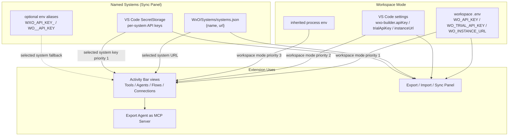
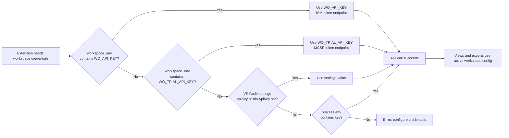
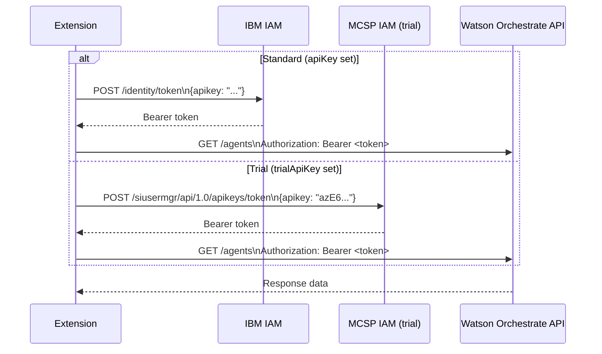
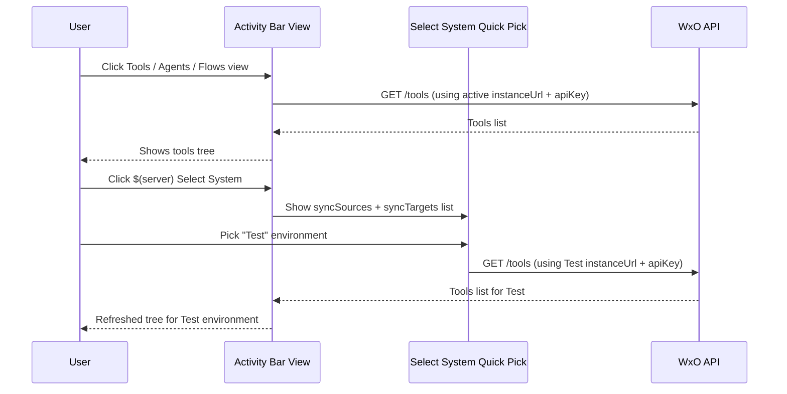
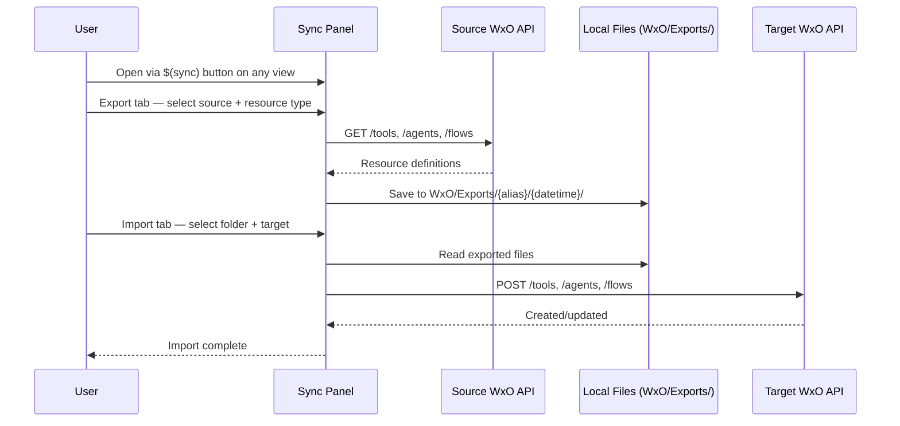

# WxO Builder — Setup Guide

**IBM Watsonx Orchestrate (WxO)** · VS Code Extension  
*Publisher: markusvankempen · Version 1.3.0 · Apache-2.0*

This guide walks you through configuring the **WxO Builder** extension: set your credentials in VS Code Settings, optionally add multiple environments for sync, and start building.

---

## Credentials Flow Overview



---

## Step-by-Step Setup

### 1. Install the Extension

Search **WxO Builder** in the VS Code Extensions Marketplace (`Ctrl+Shift+X` / `Cmd+Shift+X`), or install by ID:
```
markusvankempen.wxo-builder
```

### 2. Configure Credentials

Open **File → Preferences → Settings** (`Ctrl+,` / `Cmd+,`) and search **wxo-builder**.

These settings define the default workspace instance. If you need multiple named environments or want to switch systems from inside the extension, use the Sync Panel → Systems tab instead of repeatedly changing these values.

#### Standard (IBM Cloud API key)

| Setting | Value |
|---------|-------|
| `wxo-builder.instanceUrl` | Your WxO instance URL, e.g. `https://api.us-south.watson-orchestrate.cloud.ibm.com/instances/XXXXXXXX` |
| `wxo-builder.apiKey` | Your IBM Cloud API key |

#### Trial instance (MCSP trial key)

| Setting | Value |
|---------|-------|
| `wxo-builder.instanceUrl` | Your trial instance URL, e.g. `https://api.dl.watson-orchestrate.ibm.com/instances/XXXXXXXX` |
| `wxo-builder.trialApiKey` | Your trial API key, typically starting with `azE6` |

> **Note:** `apiKey` and `trialApiKey` can coexist. The extension uses `apiKey` first; if empty it falls back to `trialApiKey`.

**Minimal `settings.json` (standard):**
```json
{
  "wxo-builder.instanceUrl": "https://api.us-south.watson-orchestrate.cloud.ibm.com/instances/XXXXXXXX",
  "wxo-builder.apiKey": "YOUR_IBM_CLOUD_API_KEY"
}
```

**Minimal `settings.json` (trial):**
```json
{
  "wxo-builder.instanceUrl": "https://api.dl.watson-orchestrate.ibm.com/instances/XXXXXXXX",
  "wxo-builder.trialApiKey": "azE6..."
}
```

### 3. Verify in Status & Diagnostics

Open the **WxO Builder** activity bar → **Status & Diagnostics** view.

```
Status & Diagnostics
├── ✓ Configuration    API Key and Instance URL found
├── ✓ API Connection   Connected to https://api.us-south...
├── ✓ Tools            47 tools loaded
└── ✓ Agents           12 agents loaded
```

All green = ready to use.

### 4. (Optional) Add Named Systems or Sync Environments

For named environments used by **Select System**, use the **Systems** tab in the Sync Panel.

- `WxO/Systems/systems.json` stores the system name and URL.
- The API key is stored in VS Code SecretStorage.
- If a system is saved again with a blank API key field, the existing stored key is preserved.

Legacy `syncSources` and `syncTargets` settings can still be used for export/import and compare workflows:

To sync resources between environments (e.g. Production → Test), add `syncSources` and `syncTargets` to your `settings.json`:

```json
{
  "wxo-builder.instanceUrl": "https://api.us-south.watson-orchestrate.cloud.ibm.com/instances/PROD",
  "wxo-builder.apiKey": "PROD_API_KEY",
  "wxo-builder.syncSources": [
    {
      "alias": "Production",
      "instanceUrl": "https://api.us-south.watson-orchestrate.cloud.ibm.com/instances/PROD"
    },
    {
      "alias": "Test",
      "instanceUrl": "https://api.us-south.watson-orchestrate.cloud.ibm.com/instances/TEST",
      "apiKey": "TEST_API_KEY"
    }
  ],
  "wxo-builder.syncTargets": [
    {
      "alias": "Test",
      "instanceUrl": "https://api.us-south.watson-orchestrate.cloud.ibm.com/instances/TEST",
      "apiKey": "TEST_API_KEY"
    }
  ]
}
```

Use **Select System** (server icon) in any view's title bar to switch between instances. When a named system is selected, its explicit system key is used for the activity views instead of the workspace key.

---

## Credential Resolution Order



| Priority | Source | Setting / Variable |
|----------|--------|-------------------|
| 1 | Workspace `.env` — standard | `WO_API_KEY` |
| 2 | Workspace `.env` — trial | `WO_TRIAL_API_KEY` |
| 3 | VS Code Setting — standard | `wxo-builder.apiKey` |
| 4 | VS Code Setting — trial | `wxo-builder.trialApiKey` |
| 5 | Process environment — standard | `WO_API_KEY` |
| 6 | Process environment — trial | `WO_TRIAL_API_KEY` |

`instanceUrl` follows the same pattern: workspace `.env` `WO_INSTANCE_URL` → `wxo-builder.instanceUrl` → inherited `WO_INSTANCE_URL`.

For a selected named system, the URL comes from `WxO/Systems/systems.json` and the key comes from SecretStorage first, then compatible env aliases such as `WXO_API_KEY_<name>`.

---

## Auth Flow: Standard vs Trial



---

## Flow: Select System & View Resources



---

## Flow: Export / Import Between Environments



---

## Connection Secrets Setup

Connection credentials are stored per environment as `.env` files in the WxO project directory:

```
WxO/Systems/{envName}/Connections/.env_connection_{envName}
```

**File format:**
```bash
# Salesforce connection credentials
CONN_SALESFORCE_CLIENT_ID=my-client-id
CONN_SALESFORCE_CLIENT_SECRET=my-client-secret

# Weather API key
CONN_WEATHER_API_KEY=abc123
```

**To edit secrets:**
1. Open the **$(sync) Sync Panel** from any view title bar.
2. Go to the **Secrets** tab.
3. Select the environment.
4. Add/edit/remove key-value pairs.
5. Click **Save to file**.

Or use the **WxO Project Dir** view to navigate to the file and open it directly.

---

## Optional: Watson Orchestrate CLI (ADK)

The CLI is **not required** for core extension features (view, edit, create, export to file, sync between instances, export as MCP server).

Install it only if you need bulk shell-script-based workflows:

```bash
pip install --upgrade ibm-watsonx-orchestrate   # ADK 2.5.0+
```

Verify:
```bash
orchestrate --version
```

---

## Troubleshooting

| Issue | Solution |
|-------|----------|
| "Configure API Key and Instance URL before exporting" | Set `wxo-builder.apiKey` (or `trialApiKey`) **and** `wxo-builder.instanceUrl` in Settings |
| Diagnostics shows FAIL for Configuration | Use `trialApiKey` or `WO_TRIAL_API_KEY` for trial instances; trial keys typically start with `azE6` |
| Views show empty / no resources | Check API Connection in **Status & Diagnostics**; verify `instanceUrl` has no trailing `/` |
| "Select System" shows no environments | Add `syncSources` / `syncTargets` to `settings.json` |
| Export/Import fails with 401 | API key expired or wrong; re-copy from IBM Cloud dashboard |
| Trial auth fails | Verify the trial key and instance URL belong to the same trial instance |
| Wrong instance loading | Re-select the intended system from $(server) **Select System** and check whether the workspace `.env` still points at a different instance |

---

## See Also

- [USER_GUIDE.md](USER_GUIDE.md) — Full feature reference for all views and commands
- [README.md](README.md) — Quick start and marketplace description
- [CHANGELOG.md](CHANGELOG.md) — Version history
