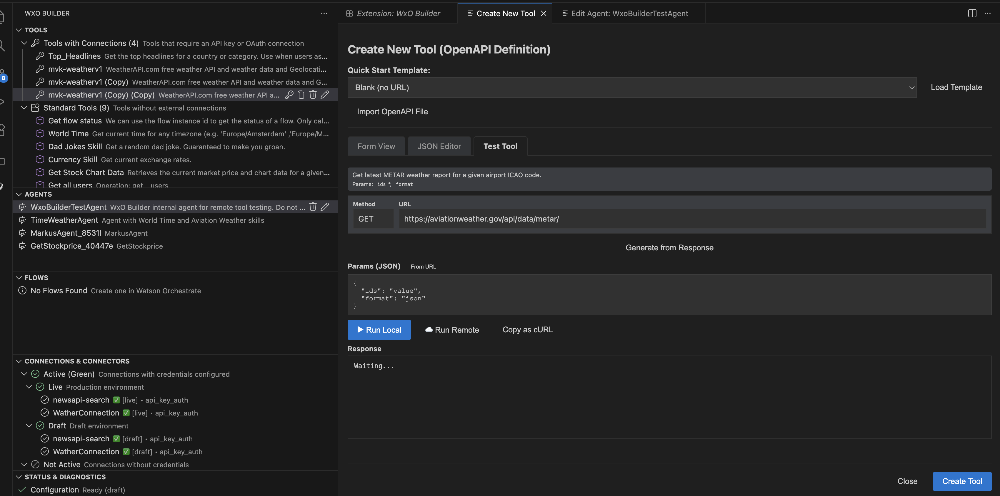
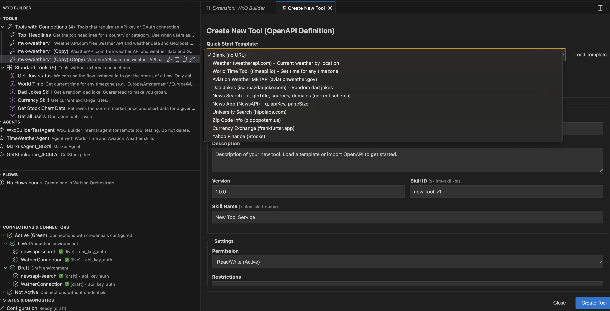
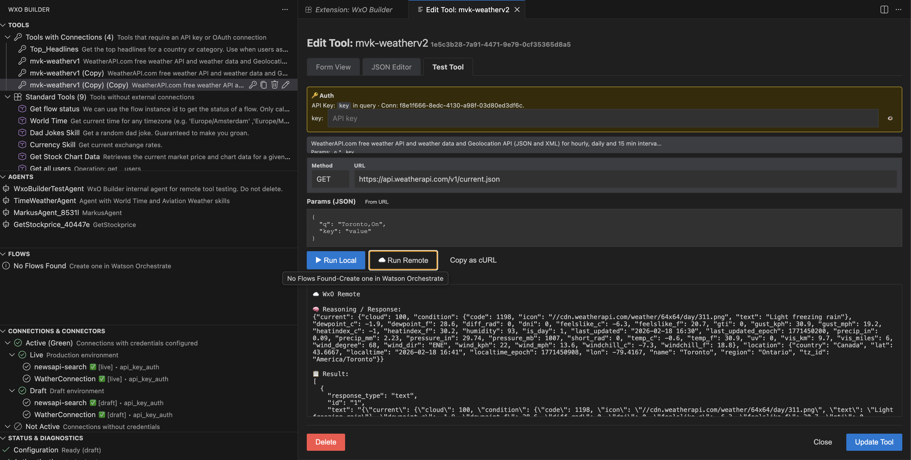
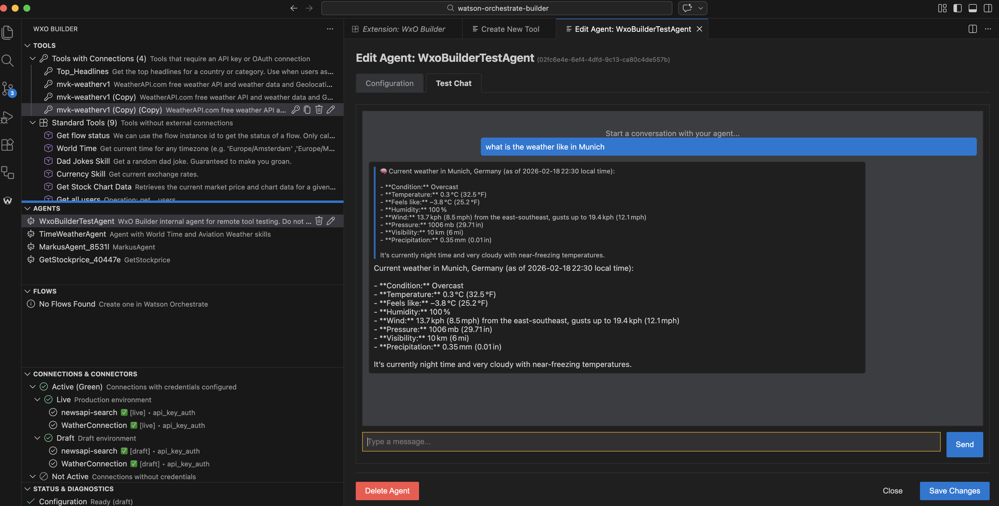
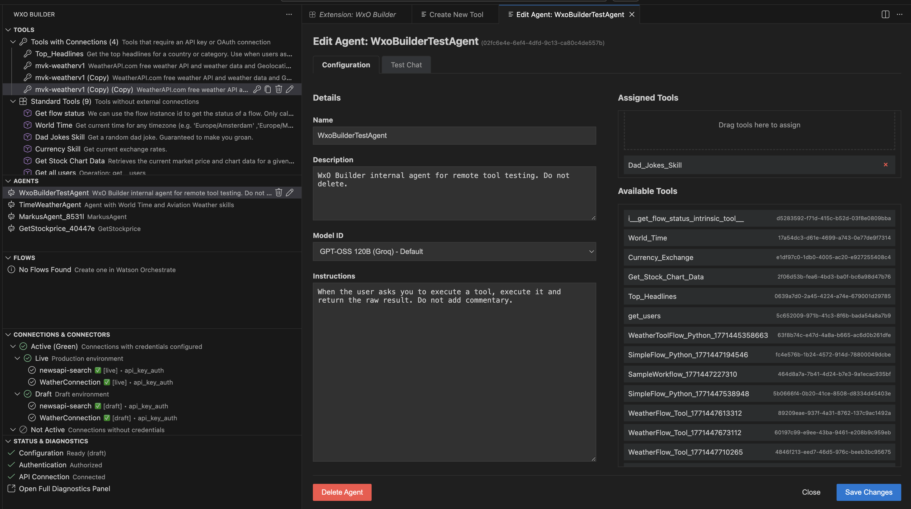

# WxO Builder — User Guide

**VS Code Extension** · IBM Watsonx Orchestrate  
*Publisher: markusvankempen · Version 1.6.4 · Apache-2.0*

Build, deploy, and manage IBM Watsonx Orchestrate AI agents, tools, flows, and connections directly from VS Code and other VS Code-based IDEs. Create OpenAPI/Python tools, test locally and remotely, export agents as MCP servers for Cursor/Claude, sync between environments, and import Langflow flows.

> **New to setup?** See [SETUP.md](SETUP.md) for credential flow diagrams and a step-by-step configuration guide.

---

## Table of Contents

1. [Prerequisites](#prerequisites)
2. [Getting Started](#getting-started)
3. [Activity Bar Views](#activity-bar-views)
4. [Sync Panel](#sync-panel)
5. [CRUD & Import/Export Summary](#crud--importexport-summary)
6. [Testing (CRUD & UI scripts)](#testing-crud--ui-scripts)
7. [Settings Reference](#settings-reference)
8. [Troubleshooting](#troubleshooting)

---

## Prerequisites

- **VS Code 1.85+** (or any VS Code-based IDE — see [Compatible IDEs](#compatible-ides))
- An **IBM Watsonx Orchestrate** instance (SaaS or on-premises) with an API key or trial API key
- No CLI installation required — the extension communicates directly with the WxO REST API

### Compatible IDEs

WxO Builder works in any VS Code-based editor:

| IDE | Notes |
|-----|-------|
| **VS Code** | Primary target; all features supported |
| **Cursor** | Export Agent as MCP Server is particularly useful here |
| **Windsurf** | Fully compatible |
| **Void** | Fully compatible |
| Other VS Code forks | Any editor built on the VS Code extension host |
---

## Getting Started

1. **Configure credentials** — Open **Settings** (`Cmd/Ctrl+,`) and search for `wxo-builder`. Set:
   - `wxo-builder.apiKey` — your IBM Cloud API key (starts with a long alphanumeric string)
   - `wxo-builder.trialApiKey` — your trial key (typically starts with `azE6`) — only needed for trial instances
   - `wxo-builder.instanceUrl` — your WxO instance URL (e.g. `https://api.us-south.watson-orchestrate.ibm.com/instances/abc123`)

   The same values can also be provided in the workspace `.env` as `WO_API_KEY`, `WO_TRIAL_API_KEY`, and `WO_INSTANCE_URL`. For workspace mode, the extension resolves the workspace `.env` before VS Code settings.

   Use these Settings entries for the default workspace instance. If you need multiple saved environments or want to switch instances from inside the extension, use the Sync Panel → Systems tab instead.

   > See [SETUP.md](SETUP.md) for a full credential flow diagram and environment variable alternatives.

2. **Browse resources** — Click the **WxO Builder** icon in the Activity Bar. Expand **Tools**, **Agents**, **Flows**, **Connections**, **Toolkits**, **Plugins**, **Knowledge Bases**, or **Evaluations** to see your WxO resources.

3. **Open the Sync Panel** — Click the sync icon in any view title bar or run `WxO Builder: Open Sync Panel` from the Command Palette (`Cmd/Ctrl+Shift+P`) to export, import, and compare environments.

---

## Activity Bar Views

The extension registers the following views in the Activity Bar:

### 🔧 Tools

Lists all tools (Python, OpenAPI) registered in your WxO instance.

| Action | Description |
|--------|-------------|
| **Create Tool** | Wizard to create Python or OpenAPI tools. Supports URL import and form templates. |
| **Edit** | Opens the JSON/form editor with Monaco editor and schema validation |
| **Export** | Export selected tool(s) to a local folder — includes `tool-spec.json`, `tool.py`, `requirements.txt`, and connection YAML |
| **Import** | Import tool(s) from a previously exported JSON file |
| **Copy** | Duplicate a tool function by reference |
| **Delete** | Remove tool(s) with confirmation |
| **Test** | Test tool locally (no API call) or remotely (live WxO call) |

**Multi-select**: Shift-click or Ctrl/Cmd-click multiple tools, then use Delete or Export from the title bar.

### 🤖 Agents

Lists all AI agents in your WxO instance.

| Action | Description |
|--------|-------------|
| **Create Agent** | New agent form with model, instructions, and tool assignment |
| **Edit** | Opens agent form/JSON editor |
| **Export** | Export to ADK format (folder per agent, with nested tool definitions) |
| **Export as MCP Server** | Generate a standalone Node.js MCP server project for use with Cursor, Claude, or other MCP clients |
| **Import** | Import agent(s) from exported JSON |
| **Drag & Drop** | Drag tools from the Tools view onto an agent to assign them |
| **Delete** | Remove agent(s) |

### 🔄 Flows

Lists Langflow-based flow tools. Create, edit, export, import, and delete flows.

### 🔌 Connections

Lists API connections. Create connections with various auth types (API Key, Bearer, Basic, OAuth). Edit connection credentials inline.

### 🧩 Plugins

Lists agent plugins (pre/post-invoke hooks). Edit plugin definitions.

### 📦 Toolkits

Lists MCP toolkit servers with their nested tools. Each toolkit entry expands to show its individual tools.

| Action | Description |
|--------|-------------|
| **Create Toolkit** | Add an MCP server (URL or files) as a toolkit |
| **Edit** | View/edit toolkit configuration |
| **Export** | Export toolkit as JSON to `WxO/Exports/.../toolkits/` |
| **Import** | Import toolkit from JSON file |
| **Delete** | Remove toolkit |

### 📚 Knowledge Bases

Lists RAG/document stores (ingested PDFs, web indexes). The "Memory" in the WxO object model.

| Action | Description |
|--------|-------------|
| **Create** | Opens the Knowledge Base editor to define metadata, upload local documents, add remote file URLs, and optionally use structured JSON fields or raw advanced JSON for external vector index or conversational-search settings |
| **Edit** | Click a knowledge base or use the context menu to update metadata and add more files or URLs via the PATCH documents endpoint |
| **Export** | Export KB metadata as JSON |
| **Delete** | Remove knowledge base and its ingested documents |

The editor supports both simple and advanced flows:

- **Basic fields**: `name`, `display_name`, `description`, and `prioritize_built_in_index`
- **JSON representation form**: `representation`, common `vector_index` fields, and a connection helper that injects a selected dependency connection into the chosen JSON path
- **Documents**: local file upload, remote file URLs, or both
- **Advanced JSON**: pass through additional `knowledge_base` fields for external vector index or conversational search configuration, or open the current JSON in the editor for direct editing

Notes:

- **Create** uses `POST /v1/orchestrate/knowledge-bases/documents`
- **Edit** uses `PATCH /v1/orchestrate/knowledge-bases/{id}/documents`
- **Export** saves the knowledge base definition returned by the API; it does not download previously ingested binary documents

The project includes both a CRUD API test (`npm run test:crud:knowledge-bases`) and a UI-mirrored flow test (`npm run test:ui:knowledge-base-editor`).

### 📊 Evaluations

Lists evaluation insights per agent. Expand an agent to see separate sections for stored evaluation runs, uploaded test cases, attached tools, recent traces, and a live run inspector that invokes the agent through the cloud run/thread APIs. This keeps persisted evaluation artifacts separate from runtime inspection while exposing observability data in the same activity.

| Action | Description |
|--------|-------------|
| **Inspect Live Run** | Send a prompt to the selected agent and open the response plus step history in a read-only document |
| **Open Evaluation Details** | View the raw evaluation payload for a stored run |
| **Open Test Case** | Inspect the stored prompt and metadata for a test case |
| **Open Attached Tool** | Inspect the full tool definition currently attached to the agent |
| **Open Trace** | Open the existing trace detail panel for a recent observability trace |
| **Export** | Export evaluation results as CSV |
| **Delete** | Remove an evaluation run |

### 🩺 Diagnostics

Run connectivity and configuration checks against your WxO instance. Reports API reachability, credentials validity, and lists resource counts.

### 📁 WxO Project Dir

A file explorer rooted at your WxO workspace directory (`wxo-builder.wxoRoot`, default `{workspaceFolder}/WxO`). Contains `Exports/`, `System/`, and other sub-folders created during export/import.

Right-click context menu: New File, New Folder, Rename, Delete, Reveal in Explorer, Copy Path, Open in Terminal.

---

## Sync Panel

Open via `WxO Builder: Open Sync Panel` or the sync icon in any view's title bar.

### ↑ Export

Export agents, tools, flows, connections, toolkits, knowledge bases, or everything to a local JSON file (`WxO/Exports/...`).

- **Resource types**: Tools, Connections, Agents, Flows, Plugins, Toolkits, Knowledge Bases
- **Include dependencies**: When checked, tools export includes their connections; agents export includes tools and connections
- **Without dependencies**: Export tools or agents alone (e.g. for porting config when dependencies already exist on target)

### ↓ Import

Push a previously exported JSON file back to WxO (same or different instance).

- **Selectable items**: Tools, connections, agents, and toolkits can be selected individually
- **Connection handling**: Prompts to import embedded connections first when present
- **Policies**: Overwrite, skip, or rename-on-conflict

### ⇄ Sync & Compare

Diff two WxO environments to identify agents, tools, or flows that differ between them.

### 🔑 Secrets

Manage per-environment `CONN_*` connection credential variables stored in `WxO/System/{env}/.env_connection_*`.

### 📊 Observability

Search and export trace data from your WxO instance (requires telemetry enabled).

### ⚙️ Systems

Configure and switch between multiple WxO instances ("Select System"). Selecting a system overrides the workspace credentials for all API calls until you switch back.

- System names and URLs are stored in `WxO/Systems/systems.json`.
- System API keys are stored in VS Code SecretStorage, not in `systems.json`.
- Re-saving a system without entering a new key preserves the existing stored key.
- Named systems use their own explicit key and do not intentionally fall back to the workspace key.

---

## CRUD & Import/Export Summary

| Object | Create | Read | Update | Delete | Export | Import |
|--------|--------|------|--------|--------|--------|--------|
| **Tools** | ✅ | ✅ | ✅ | ✅ | ✅ (with/without connections) | ✅ |
| **Agents** | ✅ | ✅ | ✅ | ✅ | ✅ (with/without tools+connections) | ✅ |
| **Connections** | ✅ | ✅ | — | ✅ | ✅ | ✅ |
| **Flows** | ✅ | ✅ | ✅ | ✅ | ✅ | ✅ |
| **Toolkits** | ✅ | ✅ | — | ✅ | ✅ | ✅ |
| **Knowledge Bases** | ✅ | ✅ | ✅ | ✅ | ✅ | — |
| **Evaluations** | (run via API) | ✅ | — | ✅ | ✅ | — |

---

## Testing (CRUD & UI scripts)

The repository includes executable test scripts that mirror UI object operations and verify WxO API behaviour.

| Suite | Location | Commands |
|-------|----------|----------|
| **CRUD** | `tests/scripts/crud/` | `npm run test:crud:agents`, `test:crud:connections`, `test:crud:tools`, `test:crud:toolkits`, `test:crud:knowledge-bases`, `test:crud:evaluations`, `test:crud:flows`, or `npm run test:crud:all` |
| **UI operations** | `tests/scripts/ui-operations/` | `npm run test:ui:export-agent`, `test:ui:export-tool`, `test:ui:export-toolkit`, `test:ui:export-knowledge-base`, `test:ui:knowledge-base-editor`, `test:ui:activate-deactivate-skill`, `test:ui:import-toolkit`, or `npm run test:ui:all` |
| **Full** | — | `npm run test:object-operations` (CRUD + UI) |

Requires a `.env` file at the project root with `WO_API_KEY` or `WO_TRIAL_API_KEY` and `WO_INSTANCE_URL`. See `tests/scripts/crud/README.md` and `tests/scripts/ui-operations/README.md` for details.

---

## Settings Reference

Configure in **Settings** (search `wxo-builder`):

Use these settings for the default workspace instance. For multiple named systems and in-extension environment switching, use the **Sync Panel → Systems** tab and the **Select System** action.

| Setting | Description | Default |
|---------|-------------|---------|
| `wxo-builder.apiKey` | IBM Cloud API key for WxO REST API | `` (or `WO_API_KEY` env var) |
| `wxo-builder.trialApiKey` | MCSP trial API key (starts with `azE6`) | `` (or `WO_TRIAL_API_KEY` env var) |
| `wxo-builder.instanceUrl` | WxO instance base URL | `` (or `WO_INSTANCE_URL` env var) |
| `wxo-builder.mcspTokenUrl` | Custom MCSP token endpoint | `https://iam.platform.saas.ibm.com/siusermgr/api/1.0/apikeys/token` |
| `wxo-builder.wxoRoot` | Root directory for WxO project files | `{workspaceFolder}/WxO` |

All credential settings can also be provided as environment variables (`WO_API_KEY`, `WO_TRIAL_API_KEY`, `WO_INSTANCE_URL`). For workspace mode, the extension resolves the workspace `.env` first, then VS Code settings, then inherited process environment variables.

---

## Troubleshooting

### "Configure API Key (or Trial API Key) and Instance URL before exporting"

You haven't set your credentials yet. Click **Open Settings** in the error notification, or go to **Settings** → search `wxo-builder` and fill in `apiKey` (or `trialApiKey`) and `instanceUrl`.

### "No agent selected" / "No tool selected"

Select one or more items in the tree view before clicking Export. You can Shift-click or Ctrl/Cmd-click to multi-select.

### "No view is registered: watsonx-project-dir"

Open a workspace folder first (File → Open Folder). The WxO Project Dir view requires a workspace root to anchor the `WxO/` directory.

### Views show "Failed to load" or are empty

1. Confirm credentials are set in either the workspace `.env` or **Settings** → `wxo-builder.apiKey` / `wxo-builder.trialApiKey` / `wxo-builder.instanceUrl`
2. Check the **Output** panel (View → Output → select `WxO Builder`) for the underlying error
3. Verify your instance URL is reachable — copy it into a browser to confirm it returns JSON

### 403 with tenant or Bearer-token mismatch

This usually means the active instance URL and API key came from different environments.

1. Re-open **Select System** and choose the intended system again
2. If using workspace credentials, check the workspace `.env` for stale `WO_API_KEY`, `WO_TRIAL_API_KEY`, or `WO_INSTANCE_URL` values
3. Reload the VS Code window so all tree views re-initialize with the same active configuration

### JSON editor not syntax-highlighting

The Monaco editor requires the extension to be fully activated. Reload the window (`Cmd/Ctrl+Shift+P` → `Developer: Reload Window`) if the editor appears blank.

### Export as MCP Server fails

Ensure at least one agent is selected in the Agents tree view, and that `wxo-builder.apiKey` and `wxo-builder.instanceUrl` are configured. The MCP export fetches live agent and tool definitions from the API.

---

## Additional Resources

- [SETUP.md](SETUP.md) — Credential flow diagrams, multi-instance configuration, trial key setup
- [IBM Watsonx Orchestrate Docs](https://developer.watson-orchestrate.ibm.com)
- [GitHub Issues](https://github.com/markusvankempen/wxo-builder-vsc/issues)
